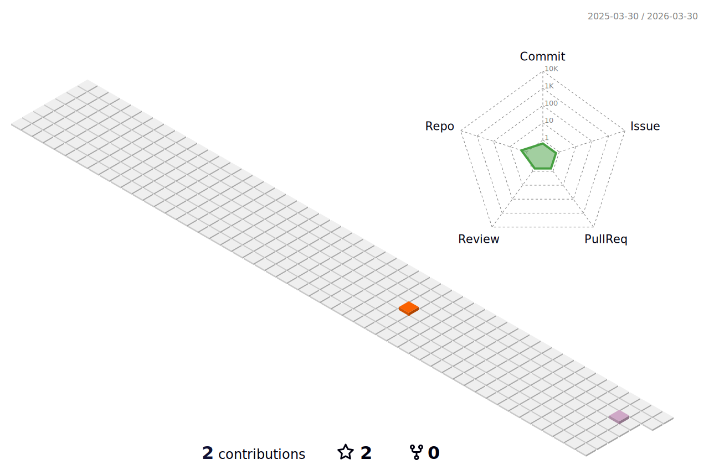

  <!-- GitHub Followers Badge -->
  

  <!-- Qiita Posts, Contributions, and Followers Badges -->
  
  
  

## 🌟 My Developer Profile 🌟

### 👨‍💻 About Me

- 💼 **Back-end developer** skilled in **Spring** and **API development**, with experience in **Vue.js** for building user interfaces.
- 🔍 Focused on building scalable, maintainable systems using **Spring** for back-end and **Vue.js** for front-end.
- 🛠 Skilled in developing **APIs** with **Spring Boot** and creating responsive **Vue.js** applications.
- 🎓 Certified in **Basic Information Technology Engineer** and **AWS Certified Cloud Practitioner**.
- 📊 Experienced in **SQL** and writing complex queries for efficient data management.

---

### 💡 Tech Stack

- **Languages**: Java, JavaScript, TypeScript, PHP (minor), VB (minor)
- **Frameworks & Libraries**: Spring, Vue.js, Laravel (minor), .NET (minor)
- **Database**: MySQL, PostgreSQL, SQLServer
- **Tools**: Git, Docker, Gradle, AWS
- **API & Communication**: REST, JSON, HTTP, JWT

---

### 🏆 GitHub Metrics

  <!-- GitHub全体のメトリクス -->
  <picture>
    <source media="(prefers-color-scheme: dark)"  srcset="output/metrics.base.svg" width="400" style="border-radius: 10px;" />
    <source media="(prefers-color-scheme: light)" srcset="output/metrics.base.svg" width="400" style="border-radius: 10px;" />
    
  </picture>
   
  <!-- 使用している言語の詳細 -->
  <picture>
    <source media="(prefers-color-scheme: dark)"  srcset="output/details.svg" width="400" style="border-radius: 10px;" />
    <source media="(prefers-color-scheme: light)" srcset="output/details.svg" width="400" style="border-radius: 10px;" />
    
  </picture>

---

### 🌐 Contribution Map

  <!-- 3Dの貢献マップ -->
  <picture>
    <source media="(prefers-color-scheme: dark)"  srcset="profile-3d-contrib/profile-night-rainbow.svg" width="700" style="border-radius: 15px;" />
    <source media="(prefers-color-scheme: light)" srcset="profile-3d-contrib/profile-season-animate.svg" width="700" style="border-radius: 15px;" />
    
  </picture>

---

### 🏅 Achievements

  <!-- Compact achievements表示 -->
  <picture>
    <source media="(prefers-color-scheme: light)"  srcset="output/metrics.plugin.achievements.compact.svg" width="400" style="border-radius: 10px;" />
    <source media="(prefers-color-scheme: dark)"  srcset="output/metrics.plugin.achievements.compact.svg" width="400" style="border-radius: 10px;" />
    
  </picture>

---

### 🏅 Certifications

- **AWS Certified Cloud Practitioner**  
  

---

  
  
  
  
  
  

<!--
**yamamotoshuma/yamamotoshuma** is a ✨ _special_ ✨ repository because its `README.md` (this file) appears on your GitHub profile.

Here are some ideas to get you started:

- 🔭 I’m currently working on ...
- 🌱 I’m currently learning ...
- 👯 I’m looking to collaborate on ...
- 🤔 I’m looking for help with ...
- 💬 Ask me about ...
- 📫 How to reach me: ...
- 😄 Pronouns: ...
- ⚡ Fun fact: ...
-->
